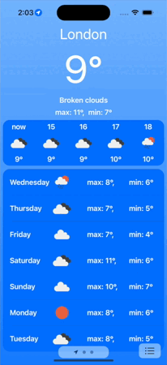
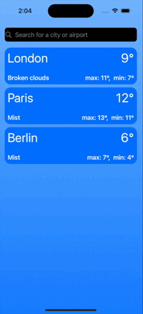
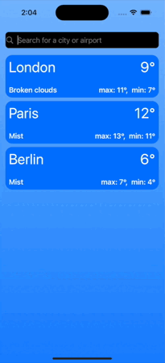

<h1 align="center">Gismeteo
<div align="center">

</div>

## Technical requirements for the project (Apple native weather):
- CollectionView usage;
- code layout;
- 2-3 screens;
- Network request (network service implementation);
- Data storage (UserDefaults, CoreData - at your discretion);
- Geolocation (desirable, for weather - mandatory);
- MVP architecture, MVVM or VIPER, Clean - as you prefer, the main thing is not MVC;

## Common project info:
- Application language - Swift;
- Minimum Deployment - IOS 17.0;
- Supported Destinations - Iphone;
- Device Orientation - Portraiе;
- Architectural pattern - Clean Swift;
- No dependencies on third-party libraries
- Design patterns used: Singleton, Delegate;

## Project App Info:
- The project was implemented as part of the practical confirmation of programming skills, as well as an indicator of understanding of the learned information, within the online intensives of the Aston IOS Trainee program.

## App pre-view:

### [Video](https://www.youtube.com/watch?v=GsI9xfTFW2c)





## Getting Started

```
# Move into a directory to store the project
cd ~/Developer
# Clone project
git clone https://github.com/logunkov/Gismeteo.git
# Move into Project directory
cd ./Gismeteo
# Open a project in Xcode 
```
