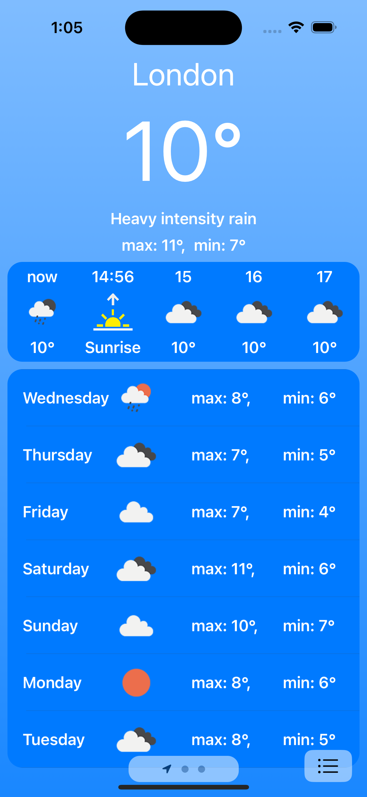
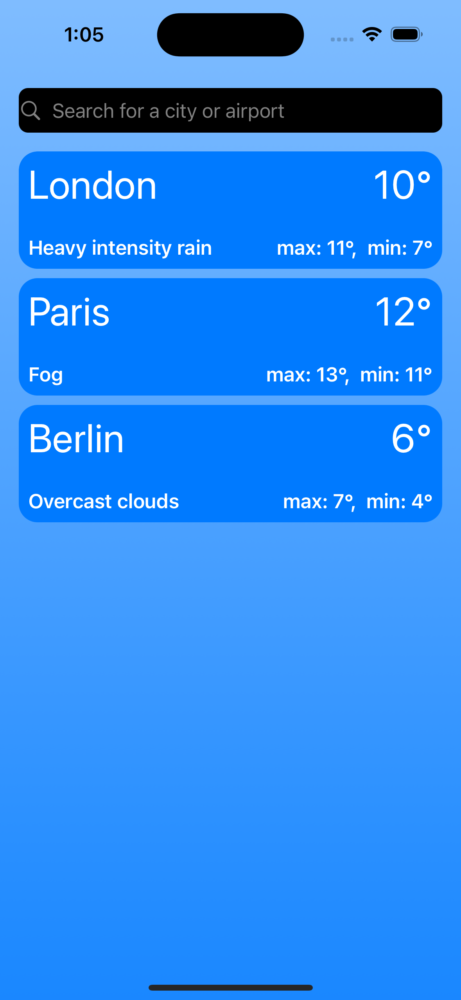
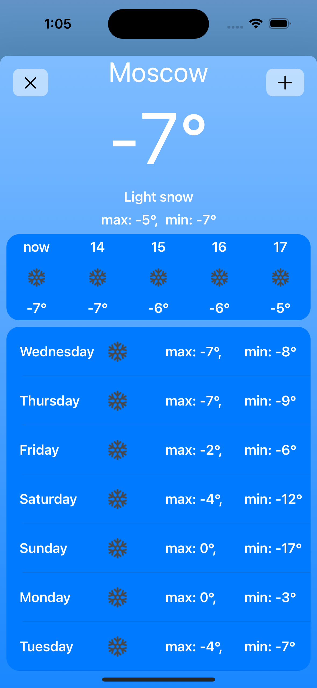

<div align="center">

</div>

## Task
Реализовать нативное приложение "Погода"


## Result

### [Video](https://www.youtube.com/watch?v=GsI9xfTFW2c)





## Getting Started

```
# Move into a directory to store the project
cd ~/Developer
# Clone project
git clone https://github.com/logunkov/Gismeteo.git
# Move into Project directory
cd ./Gismeteo
# Open a project in Xcode 
```

## Component Libraries
- [x] Написано на Swift 5.9
- [x] Поддерживается версия iOS 17
- [x] Зависимостей от сторонних библиотек нет.
- [x] Необходим Xcode 15 или выше.
